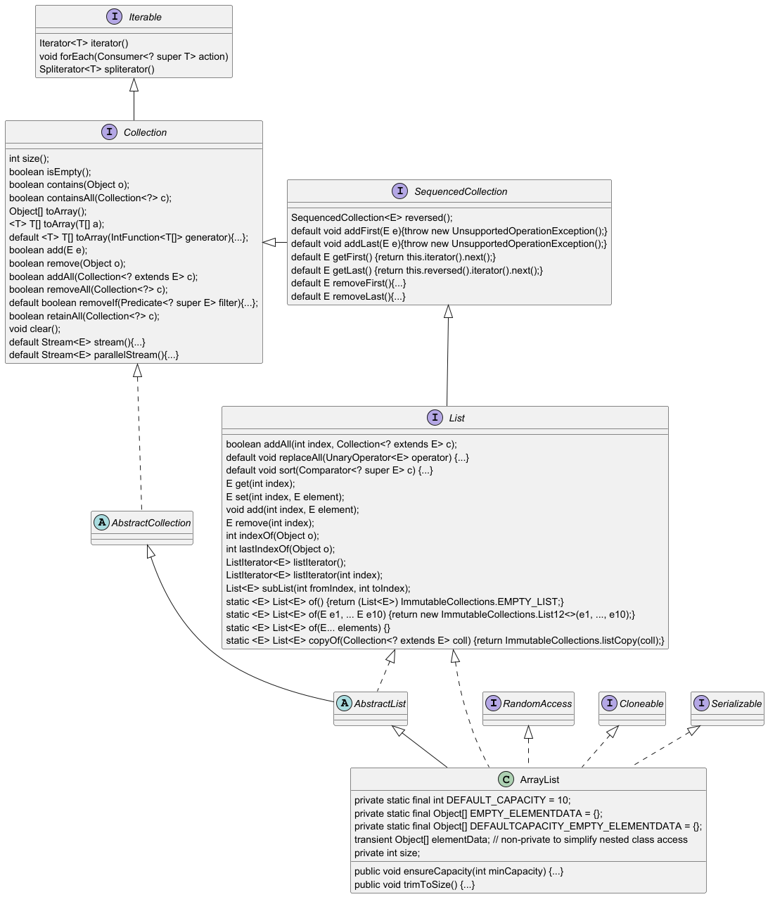

## Иерархия коллекций

### 1. Рассмотрим коллекции на примере ArrayList в Java 21



### public interface Iterable\<T>
Корневой интрефейс, который
имеет метод iterator(), который должен возвращать объект одноименного интерфейса Iterator<E>, который в свою очередь 
имеет метод hasNext() для проверки наличия следующего элемента в коллекции.
Из названия интерфейса Iterable понятно что он итерирует, то есть повторяет одно и тоже действие - перебирает коллекцию!
это один из самых основных интерфейсов на котором далее построены все коллекции!
от этого интерфейса в 21 версии Java библиотеки наследуются аж 469 !!! других классов и интерфейсов 

### public interface Collection\<E> extends Iterable\<E> 
Следующим интерфейсом на пути к динамическому массиву (ArrayList) является **Collection** - один из наследников Iterable
Данный интерфейс уже имеет множество методов, которые мы привыкли использовать в ArrayList:
+ ```java
    int size();  // возвращает кол-во элементов коллекции
    ```
+ ```java
    boolean isEmpty(); // если коллекция пустая то должен возвращать true
    ```  
+ ```java
    boolean contains(Object o); // проверяет наличие определенного объекта в коллекции
  ``` 
+ ```java
    Object[] toArray(); // toArray() в различных реализациях с разными сигнатурами метода, может возвращать массив Object, либо массив элементов либого другого типа через дженерики
  ``` 
+ ```java
    boolean add(E e); // добавление элемента в коллекцию
  ``` 
+ ```java
    boolean remove(Object o);  // удаление элемента из коллекции
  ``` 
+ ```java
    void clear();  // удаляет ВСЕ элементы из коллекции
  ``` 
+ ```java
    default boolean removeIf(Predicate<? super E> filter);  // удаляет елементы по определенному условию - фильтру. Возможно использовать с функциональным подходом предиката
  ``` 
+ ```java
    boolean removeAll(Collection<?> c);  //  удаляет все элементы из текущей коллекции, которые передаются в параметре метода
  ``` 
+ ```java
    boolean addAll(Collection<? extends E> c);  //  добавляет все элементы из текущей коллекции, которые передаются в параметре метода
  ``` 
+ ```java
    boolean containsAll(Collection<?> c);  //  проверяет, содержатся ли все элементы в коллекции, которые передаются в параметре другой коллекции
  ``` 
+ ```java
    boolean retainAll(Collection<?> c); // Сохраняет в этой коллекции только те элементы, которые содержатся в указанной коллекции. Другими словами, удаляет из этой коллекции все ее элементы, которые не содержатся в указанной коллекции.
   ```

**_также с версии Java 1.8 появились методы для параллельного выполнения потоков:_**
+ ```java
    default Spliterator<E> spliterator() { return Spliterators.spliterator(this, 0);}
  ```
+ ```java
    default Stream<E> stream() { return StreamSupport.stream(spliterator(), false);}
  ```
+ ```java
    default Stream<E> parallelStream() { return StreamSupport.stream(spliterator(), true);}
  ```

### public interface SequencedCollection\<E\> extends Collection\<E>
**SequencedCollection** наследует Collection добавляя в нее методы очередности. 

Это коллекция, которая имеет четко определенный порядок, поддерживает операции на обоих концах и является обратимой.
Элементы упорядоченной коллекции имеют порядок, где концептуально элементы имеют линейное расположение 
от первого элемента к последнему. 
Для любых двух элементов один элемент находится либо перед (ближе к первому элементу), 
либо после (ближе к последнему элементу) другого элемента.

В этом интерфейсе дополнительно появляются методы:
+ ```java
    SequencedCollection<E> reversed();  //  возвращается коллекция элементы которой перевернуты в обратном порядке
  ``` 
+ ```java
    void addFirst(E e);  // добавление элемента в начало коллекции
  ```
+ ```java
    void addLast(E e);  // добавление элемента в конец коллекции
  ```
+ ```java
    default E getFirst() { return this.iterator().next();}  // получение первого элемента коллекции
  ``` 
+ ```java
    default E getLast()  { return this.reversed().iterator().next();}  // // получение последнего элемента коллекции
  ``` 
+ ```java
  default E removeFirst() { // удаление первого элемента
        var it = this.iterator();
        E e = it.next();
        it.remove();
        return e;
    }
  ```

+ ```java
    default E removeLast() {  // удаление последнего элемента
    var it = this.reversed().iterator();
    E e = it.next();
    it.remove();
    return e;
    }
    ```


### public interface List\<E> extends SequencedCollection\<E>

следующим интерфейсом является List - и уже он представляет собой многофункционального родителя ArrayList и прямого наследника 
Collection через SequencedCollection, который добавляет возможность работы с первым и последними элементами коллекций и изменение расположения элементов

Из документации описано следующее определение List:

_Упорядоченная коллекция, в которой пользователь имеет точный контроль над тем, куда в списке вставляется каждый элемент.
Пользователь может обращаться к элементам по их целочисленному индексу (позиции в списке) и выполнять поиск элементов в списке._

в List добавляеся множество дополнительных методов, опишем ниже каждый:
+ ```java
    static <E> List<E> of() {  // метод создания пустой неизменяемой коллекции
        return (List<E>) ImmutableCollections.EMPTY_LIST;  // это неизменяемые коллекции, которые не поддаются редактированию с применением операций вставки, удаления или очистки
    }
    ```
+ ```java
    static <E> List<E> of(E e1) {  // метод создания неизменяемой коллекции c одним элементом
        return new ImmutableCollections.List12<>(e1);
    }
  
  static <E> List<E> of(E e1, E e2) {  // метод создания неизменяемой коллекции c двумя элементами
        return new ImmutableCollections.List12<>(e1, e2);
    }
  
  static <E> List<E> of(E e1, E e2, E e3) {  // метод создания неизменяемой коллекции c тремя элементами
        return ImmutableCollections.listFromTrustedArray(e1, e2, e3);
    }
  
  static <E> List<E> of(E e1, ......, E e10) {  // и т.д. до 10 элементов
        return new ImmutableCollections.listFromTrustedArray(e1, ..., e10);
    }
  ```
+ ```java
    static <E> List<E> copyOf(Collection<? extends E> coll) {
        return ImmutableCollections.listCopy(coll);  // Возвращает неизменяемый список, содержащий элементы данной коллекции в порядке их повторения.
    }
    ```
+ ```java
    boolean addAll(int index, Collection<? extends E> c);  // вставляет все элементы из указанной коллекции в этот список в указанном месте
    ```
+ ```java
    boolean retainAll(Collection<?> c);  // удаляет из списка все его элементы, которые не содержатся в коллекции передаваемой в параметре метода
    ```
+ ```java
    default void replaceAll(UnaryOperator<E> operator) {  // Заменяет каждый элемент этого списка результатом применения оператора к этому элементу.
        Objects.requireNonNull(operator);                 // Параметры: operator – оператор, применяемый к каждому элементу
        final ListIterator<E> li = this.listIterator();
        while (li.hasNext()) {
            li.set(operator.apply(li.next()));
        }
    }
    ```
+ ```java
    default void sort(Comparator<? super E> c) {  //  Сортирует этот список в соответствии с порядком, заданным указанным компаратором
        Object[] a = this.toArray();        
        Arrays.sort(a, (Comparator) c);           // Сортировка стабильна: этот метод не должен изменять порядок одинаковых элементов.
        ListIterator<E> i = this.listIterator();
        for (Object e : a) {
            i.next();
            i.set((E) e);
        }
    }
    ```
+ ```java
    E get(int index);  // получение элемента листа по его индексу
    ```
+ ```java
    E set(int index, E element);  // Заменяет элемент в указанной позиции этого списка на новый элемент 
    ```
+ ```java
    void add(int index, E element);  // Вставляет указанный элемент в указанную позицию в этом списке (необязательная операция).
  // Сдвигает элемент, находящийся в данный момент в этой позиции (если таковой имеется), и все последующие элементы вправо (добавляет единицу к их индексам).
    ```
+ ```java
    E remove(int index); // удаляет элемент по его индексу
    ```
+ ```java
    int indexOf(Object o);  // Возвращает индекс первого появления указанного элемента в этом списке или -1, если этот список не содержит элемента.
    ```
+ ```java
    int lastIndexOf(Object o);  // Возвращает индекс последнего вхождения указанного элемента в этот список, или -1
    ```
+ ```java
    ListIterator<E> listIterator();  // Возвращает итератор списка по элементам этого списка (в правильной последовательности).
    ```
+ ```java
    ListIterator<E> listIterator(int index);  // Возвращает ListIterator для элементов в этом списке, начиная с указанной позиции в списке. 
    ```
+ ```java
    List<E> subList(int fromIndex, int toIndex);  // Возвращает представление части этого списка между указанными fromIndex, включительно, и toIndex, исключая. (Если fromIndex и toIndex равны, возвращаемый список пуст.)
    ```
+ ```java
    @Override
    default Spliterator<E> spliterator() {  // Создает Spliterator для элементов в этом списке.
        if (this instanceof RandomAccess) { // Spliterator сообщает о Spliterator.SIZED и Spliterator.ORDERED
            return new AbstractList.RandomAccessSpliterator<>(this);
        } else {                            // Реализации должны документировать представление дополнительных значений характеристик.
            return Spliterators.spliterator(this, Spliterator.ORDERED);
        }
    }
    ```
+ ```java
    @SafeVarargs
    @SuppressWarnings("varargs")
    static <E> List<E> of(E... elements) {  // Возвращает неизменяемый список, содержащий произвольное количество элементов.
        switch (elements.length) { // implicit null check of elements
            case 0:
                @SuppressWarnings("unchecked")
                var list = (List<E>) ImmutableCollections.EMPTY_LIST;
                return list;
            case 1:
                return new ImmutableCollections.List12<>(elements[0]);
            case 2:
                return new ImmutableCollections.List12<>(elements[0], elements[1]);
            default:
                return ImmutableCollections.listFromArray(elements);
        }
    }
    ```


### public abstract class AbstractCollection\<E> implements Collection\<E>

плавно переходим от интерфейсов к классам. 
**Первый абстрактный класс это  AbstractCollection, который реализует методы интерфейса Collection**

### public abstract class AbstractList\<E> extends AbstractCollection\<E> implements List\<E>

**Класс AbstractList наследуется от AbstractCollection и дополнительно реализовывает методы интерфейса List.**


### public class ArrayList\<E> extends AbstractList\<E> implements List\<E>, RandomAccess, Cloneable, java.io.Serializable

