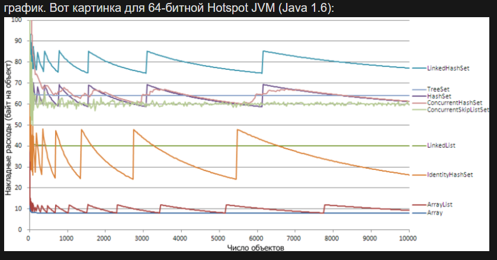

### Array

Самый простой вариант — массив, для которого наперёд известно число элементов. 

В нём на каждый объект хранится ссылка: 4 (8) байт (в скобках значение для 64-битной JVM), 
кроме того хранится длина массива — int, 4 байта, и дескриптор объекта — 8 (16) байт. 

Вдобавок каждый объект выравнивается по 8 байтам из-за чего массивы с чётным числом элементов на 32bit теряют по 4 байта.

Итог: по 4 (8) байт на объект плюс постоянная от 12 до 24 байт (постоянную можно не учитывать).

Пустой массив занимает 16 (24) байт.

### ArrayList

Тут почти то же самое с небольшим отличием: 
так как заранее число элементов в массиве неизвестно, массив выделяется с запасом (по умолчанию на 10 элементов) 
и при необходимости расширяется чуть больше, чем в полтора раза:

Константа также немного больше: 40 (64) байта, так как помимо массива есть ещё сам объект ArrayList, 
в котором хранится ссылка на массив, фактический размер списка и количество модификаций 
(для выкидывания ConcurrentModificationException). 

Тем не менее, это самый экономный способ хранить однотипные данные, если вы заранее не знаете, сколько их будет.

Конструированный по умолчанию ArrayList без элементов занимает 80 (144) байта.
И также по 4 (8) байт на объект

### LinkedList

Для связанного списка картинка похожа на массив: 
стремится к асимптоте по гиперболе. 

Для каждого элемента списка создаётся по одному служебному объекту типа java.util.LinkedList.Entry. 
Каждый из этих объектов содержит по три ссылки (на сам элемент списка, на предыдущий и последующий Entry), 
при этом из-за выравнивания на 32bit теряется по 4 байта, поэтому в итоге требуется 24 (40) байт на каждый Entry. 

Константа включает в себя дескриптор объекта LinkedList, головной Entry и ссылку на него, 
размер списка и количество модификаций и равна 48 (80) байт. 
Столько же занимает пустой список, так как никакой памяти про запас здесь, конечно, не выделяется.

**Таким образом в среднем LinkedList занимает чуть меньше чем в 5 раз больше памяти чем ArrayList !!!**

